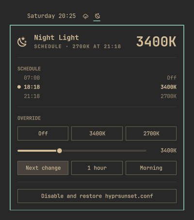

# Sunset Night Light for Omarchy

An [Omarchy](https://omarchy.org) shell plugin that warms your screen at your
local sunset instead of at fixed times. It also adds a bar icon that shows what
the night light is doing and lets you override it.



- **Follows the sun.** Every day it works out sunset for your location and
  schedules [hyprsunset](https://github.com/hyprwm/hyprsunset):
  - 3400K at sunset
  - 2700K three hours later
  - off at 07:00

  All of these are configurable.
- **Bar icon.** A moon appears in the evening, or while an override is on, and
  is hidden during the day. It is highlighted while an override is on and
  shows a warning if hyprsunset stops responding.
- **Popup.** Shows today's schedule, preset buttons (Off, the scheduled
  temperatures), a temperature slider, and how long to hold an override: until
  the next scheduled change, for an hour, or until morning. *Resume schedule*
  ends an override.
- **Overrides persist.** hyprsunset normally drops a manual temperature at its
  next scheduled switch. The plugin re-applies an override until it expires,
  even across hyprsunset restarts.

## Install

```bash
omarchy plugin add https://github.com/agkrishnendu/omarchy-nightlight.git --enable
```

Then click the moon in the bar and choose **Enable sunset schedule**.

**The plugin changes nothing until you enable it.** Enabling does two things:

1. It moves your `~/.config/hypr/hyprsunset.conf` to
   `~/.config/hypr/hyprsunset.conf.pre-nightlight`.
2. It replaces that file with a generated schedule, which it rewrites daily as
   sunset shifts.

Until you enable it, the moon stays in the bar with a setup prompt, and the
plugin doesn't touch your files or hyprsunset.

To update, run `omarchy plugin update io.github.agkrishnendu.nightlight`, then
`omarchy restart shell`. Without the restart, the shell's hot reload can leave
the old copy of the widget running alongside the new one.

### Remove the built-in night light toggle (recommended)

Omarchy's indicators widget has its own night light toggle, which switches
between 4000K and 6500K and ignores the schedule. To hide it, list the other
indicators on the `omarchy.indicators` entry in `~/.config/omarchy/shell.json`:

```json
{ "id": "omarchy.indicators", "items": ["Dictation", "ScreenRecording", "Reminder", "Dnd", "StayAwake"] }
```

The `omarchy toggle nightlight` keybinding still works. A temperature set with
it lasts until the next scheduled change.

## Dependencies

| Dependency | Needed for | Notes |
|------------|------------|-------|
| [hyprsunset](https://github.com/hyprwm/hyprsunset) | Changing the screen temperature | Ships with Omarchy. The plugin starts it if it isn't running. |
| `python3` | The schedule script | Ships with Omarchy. Uses the standard library only. |
| `hyprctl`, `pgrep`, `pkill` | Talking to and restarting hyprsunset | Ship with Hyprland and Arch. |
| `uwsm-app` | Starting hyprsunset in its own systemd scope | Ships with Omarchy. Falls back to a detached process without it. |
| Network access to [wttr.in](https://wttr.in) | Finding your location from your IP address | Only used when the weather widget has no location set. The result is cached. |

## Using it

| On the bar icon | Does |
|-----------------|------|
| Left click      | Open the popup |
| Right click     | Turn off until the next scheduled change, or resume the schedule if an override is on |
| Middle click    | Refresh |

The icon is hidden during the day once the plugin is enabled. To open the
popup anyway, for example from a keybinding, run:

```bash
omarchy-shell io.github.agkrishnendu.nightlight open    # also: close, toggle, refresh, resume
```

## Settings

Edit these in the Omarchy settings panel, or on the plugin's entry in
`shell.json`:

| Key | Default | Meaning |
|-----|---------|---------|
| `eveningTemperature` | `3400` | Kelvin applied at sunset |
| `lateTemperature` | `2700` | Kelvin applied later in the evening |
| `lateAfterMinutes` | `180` | Minutes after sunset to switch to the late temperature; `0` disables it |
| `offTime` | `"07:00"` | When the filter turns off in the morning |

Changes apply at the widget's next check, within 30 seconds.

### Location

The plugin uses the location set in Omarchy's weather widget (click the place
name in the weather popup). Without one, it detects your location from your IP
address through wttr.in and caches the result.

## Command line

The widget is a thin front end to the bundled `src/nightlight-schedule.py`,
which you can also run yourself:

```bash
S=~/.config/omarchy/plugins/io.github.agkrishnendu.nightlight/src/nightlight-schedule.py
$S enable                         # back up hyprsunset.conf and start the schedule
$S status                         # now 3400K, 2700K at 21:18
$S set 2700 --until morning       # --until next | morning | 1h | 30m | HH:MM
$S set off                        # off until the next scheduled change
$S resume                         # back to the schedule
$S restart                        # if hyprsunset stops answering
$S disable                        # restore your hyprsunset.conf
$S status --json                  # what the widget reads
```

To make it a command, symlink it onto your `PATH`:

```bash
ln -s ~/.config/omarchy/plugins/io.github.agkrishnendu.nightlight/src/nightlight-schedule.py ~/.local/bin/nightlight-schedule
```

## How it works

- Once enabled, it writes `~/.config/hypr/hyprsunset.conf` with the day's
  profiles. It rewrites the file only when the date, your settings or the
  weather location has changed, and restarts hyprsunset only if the file
  actually changed.
- The first line of the generated file marks it as the plugin's. The plugin
  never rewrites a `hyprsunset.conf` without that line, so if something else
  replaces the file (for example `omarchy refresh`), the plugin stops and asks
  to be enabled again.
- The widget runs `nightlight-schedule sync` every 30 seconds and again right
  after each scheduled change. When enabled, `sync` does three things:
  1. starts hyprsunset if it isn't running
  2. refreshes the profiles when needed
  3. re-applies an active override
- Its state is kept in `~/.local/state/nightlight-schedule/`: the override,
  the last settings used, and the cached coordinates.

## Uninstall

First give your `hyprsunset.conf` back. Either open the popup and click
**Disable and restore hyprsunset.conf** (it asks you to click twice), or run:

```bash
~/.config/omarchy/plugins/io.github.agkrishnendu.nightlight/src/nightlight-schedule.py disable
```

This moves `hyprsunset.conf.pre-nightlight` back into place, restarts
hyprsunset with it, and deletes the plugin's state. If you had no
`hyprsunset.conf` before, it removes the generated file and stops hyprsunset
instead. Then remove the plugin:

```bash
omarchy plugin remove io.github.agkrishnendu.nightlight
rm -rf ~/.local/state/nightlight-schedule   # optional: the cached location
```

## Development

```
manifest.json               plugin manifest and settings schema
Panel.qml                   bar icon and popup; renders `status --json`
preview.png                 marketplace preview
src/nightlight-schedule.py  command entry point
src/nightlight/
  config.py                 paths, defaults, state files
  sun.py                    location lookup and sunset calculation
  hyprsunset.py             hyprctl IPC, starting and stopping hyprsunset
  lifecycle.py              enable (with consent) and disable (restore)
  profiles.py               generating and reading hyprsunset.conf
  schedule.py               time logic over the daily profiles (no I/O)
  override.py               overrides and keeping them applied
  status.py                 the status report
  cli.py                    argument parsing and `sync`
tests/                      unit tests (standard library only)
```

Run the tests and check the plugin before you push:

```bash
python3 -B -m unittest discover -s tests
omarchy plugin validate .
```

The tests point every path at a temporary directory and replace hyprsunset
with a stub, so they never touch your screen or config.

## License

[MIT](LICENSE)
